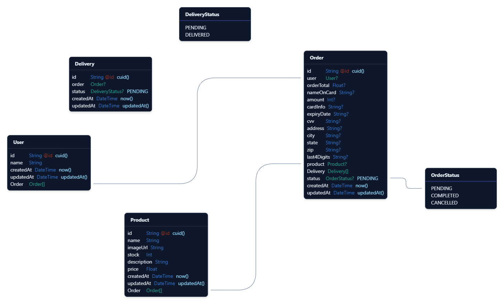

# Transactions backend

This is the backend for the transactions app. It's built with Nest.js and uses a PostgreSQL database.

> [!IMPORTANT]  
> You must have Docker installed to create the PostgreSQL database.

## Development

To begin working on the backend, first install the dependencies:

```bash
pnpm install
```

Then, generate the Prisma types from the schema:

```bash
pnpm prisma generate
```

Finally, start the development server:

```bash
pnpm dev
```

The server will be running at [http://localhost:3000](http://localhost:3000).

## API Behavior

* If the orderTotal is less than 1500, the endpoint will fail, otherwise, will complete the order

## Testing

To run the tests, use the following command:

```bash
pnpm test

# Or

pnpm test:watch

# Or

pnpm test:cov
```

## API Documentation

The API documentation is built using Swagger. To view the documentation, start the server and navigate to [http://localhost:3000/swagger](http://localhost:3000/swagger).

## Seed data

To seed the database with data, run the following command:

```bash
pnpm dlx tsx seed.ts
```

## Database model

The database is modeled using Prisma. The schema can be found in [prisma/schema.prisma](prisma/schema.prisma). Here's a visual representation of the model:


